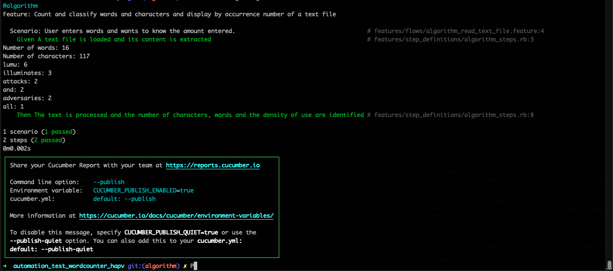

# Automation test word_counter.net

Test to web page in (https://wordcounter.net/)

## Getting Started

These instructions will get you run the tests.

### Prerequisites

To run the test, is necessary that you install (MacOS - Linux):
 - `Homebrew`
 - `Ruby`
 -  Remember that the version of chromedriver and google chrome must be the same.
  ``` brew install chromedriver ```

## Get the code

Git:

    With HTTPS
    git clone https://github.com/haroldpineda/automation_test_wordcounter_hapv.git
    
Or simply [ download a zip ](https://github.com/haroldpineda/automation_test_wordcounter_hapv/archive/refs/heads/main.zip) file

### 1)Installing
Go to the root folder of the project.

In the project the .example.env file can be renamed as .env

To install all gems, run this command:

```
bundle install
```
### 2) Run the scenarios:

Default all scenarios:

```bash
cucumber --tags @all_scenarios
```

Specification tag:

```bash
cucumber --tags @scenario_001
```
Specification BROWSER:

Default browser is Google Chrome

```bash
cucumber BROWSER=chrome
cucumber BROWSER=firefox
```
To run all the scenarios and generate a report with cucumber use:

```bash
cucumber --tags @all_scenarios --publish
```
View your Cucumber Report at:


To run the text processing algorithm scenario use:
```bash
cucumber --tags @algorithm
```

