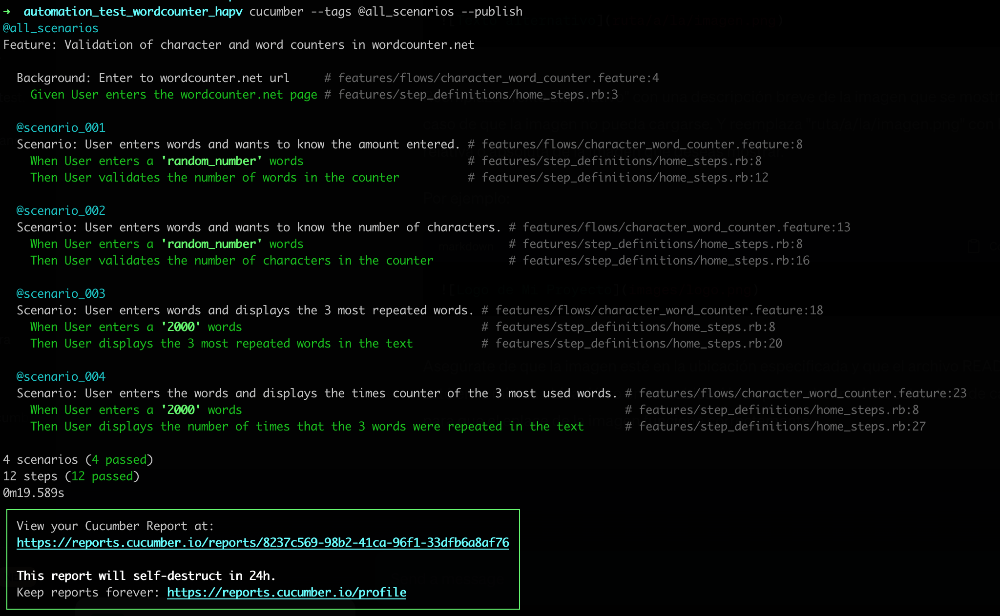

# Automation test word_counter.net

## Setup

### 1) Install gems.

```bash
bundle install
```

### 2) Run the scenarios:

Default all scenarios:

```bash
cucumber --tags @all_scenarios
```

Specification tag:

```bash
cucumber --tags @scenario_001
```
Specification BROWSER:

Default browser is Google Chrome

```bash
cucumber BROWSER=chrome
cucumber BROWSER=firefox
```
To run all the scenarios and generate a report with cucumber use:

```bash
cucumber --tags @all_scenarios --publish
```
View your Cucumber Report at:
